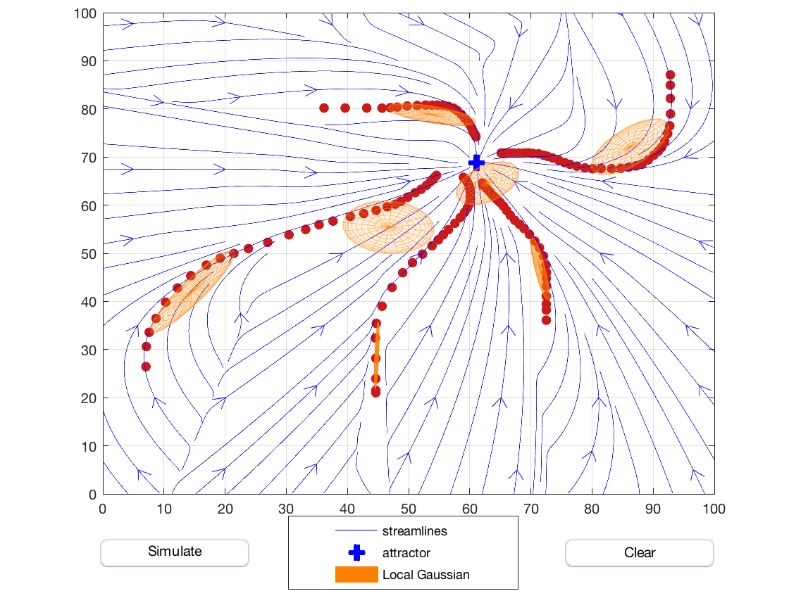

# lpv_em
This repository provides MATLAB code to estimate stable dynamical systems (DS) from data. 
It uses <a href="https://yalmip.github.io/">YALMIP</a> and includes the sedumi solver as a submodule, but you can use any other solver of your choice supported by YALMIP (check <a href="https://yalmip.github.io/allsolvers/">here</a> for a list of supported solvers). 
For nonconvex problems it relies on <a href="https://de.mathworks.com/matlabcentral/fileexchange/43643-fminsdp">FMINSDP</a>.
If you use this code for your research please cite
```
J. Medina and A. Billard, 'Learning Stable Task Sequences from Demonstration with Linear Parameter Varying Systems and Hidden Markov Models'. In Conference on Robot Learning (CoRL), Mountain View, U.S.A., 2017.' 
```
To run the code first init and update the respective submodules. In the terminal, go to your lpv_em folder
```
$ cd your_lpv_em_folder
```
then
```
$ git submodule update --init --recursive
```
After this, to test the LPV-EM algorithm in the MATLAB command window run
```
$ demo_gui_mix_lds_inv_max
```
and draw some trajectories on it. After each trajectory is drawn, the optimal model parameters will be recomputed. You should get something like this


The repo also provides alternative solutions:
- 'demo_gui_mix_lds.m' considers a standard mixture of linear dynamical systems and tries to solve the estimation problem relying on nonconvex problems. As a result it might get stuck into local minima. 
- 'demo_gui_mix_inv_lds.m' considers a mixture of inverse linear dynamcal systems and therefore remains convex. However, the inverse formulation might produce inaccurate results. 
- demos without gui: 'demo_lds.m' (1 single DS), 'demo_inv_lds.m' (1 single inverse DS), 'demo_mix_lds.m' (mixture DS), 'demo_mix_inv_lds.m' (mixture inverse DS), 'demo_mix_lds_inv_max.m' (LPV-EM algorithm),
